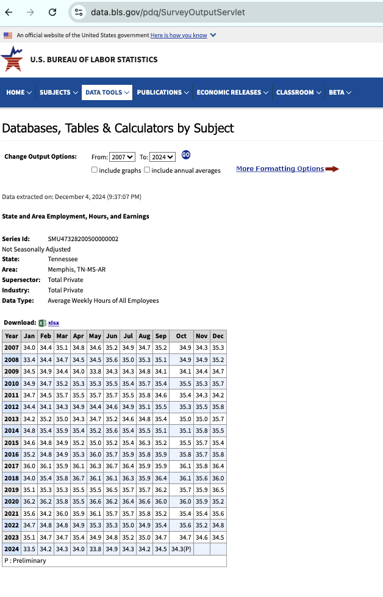
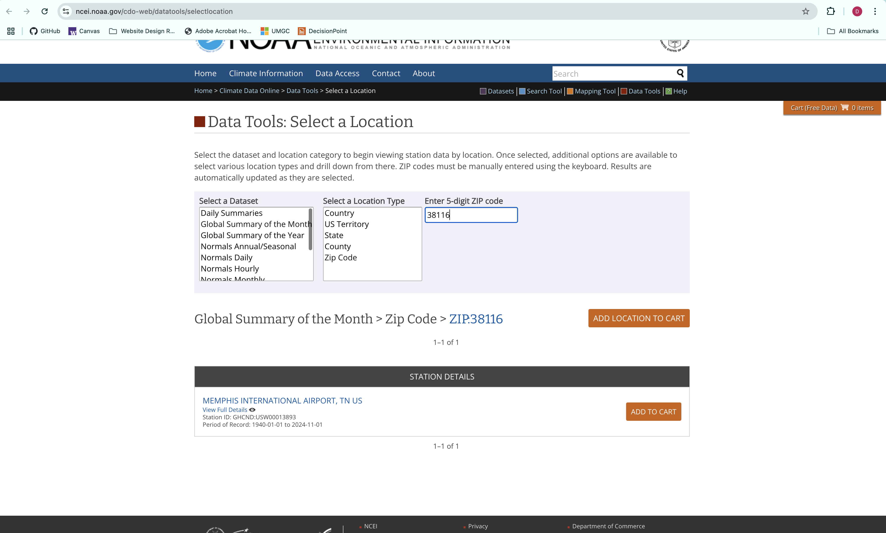

# Economic Impact Model

The Economic Impact Model predicts unemployment rates in Memphis by analyzing the combined effects of wildfire smoke exposure, economic trends, and weather conditions. It uses monthly BLS data on labor metrics and NOAA weather data from 2009-2020, along with smoke impact scores generated by the Smoke Impact Model. To maintain consistency across datasets, yearly smoke impact scores were converted into monthly values. Built with a gradient-boosted decision tree approach, the model captures complex relationships between these variables. Future predictions from 2025 to 2051 were made by estimating values for the model features using 5-year rolling averages

# Stage 0: Data Acquisition

## BLS CES (SAE) Data

### **Description:**

Here are the steps that were taken to obtain the **BLS CES SAE Average Weekly Hours of all Employees** dataset

1. Go to the [BLS CES (SAE)](https://www.bls.gov/sae/data/) website
2. Select the "One Screen" database search option
3. Make the selections indicated in the image below to obtain the `Average Weekly Hours of all Employees` data
   
4. Ensure date range is set to 2007 - 2024 as depicted in the image below, then export to csv
   

## BLS LAUS Data

### **Description:**

Here are the steps that were taken to obtain the **BLS LAUS** dataset

1. Go to the [BLS LAUS](https://www.bls.gov/lau/data.htm) website
2. Select the "One Screen" database search option
3. Make the selections indicated in the image below to obtain the `Average Weekly Hours of all Employees` data
   
4. Ensure date range is set to 2007 - 2024 as depicted in the image below, then export to csv
   

## NOAA Data

### **Description:**

Here are the steps that were taken to obtain the NOAA Global Summary of the Month data

1. Go to the [NOAA Climate Data Online](https://www.ncei.noaa.gov/cdo-web/datatools/selectlocation) website
2. Make the selections indicated in the image below to obtain the GSOM data for the Memphis International Airport
   
3. Go to the cart and ensure the following options are selected before hitting the Continue button:
   
4. Ensure the following data types are selected before hitting the Continue button: DX32, DX90, DP01, DP10, EMXP, PRCP, SNOW, TAVG, CDSD, EMXT, EMNT, HDSD, TMAX, TMIN, AWND, WDF2, WDF5, WSF2
5. Enter your email address and click the Submit Order button
6. Monitor your email for a confirmation that you data is ready for download

| Variable | Description                      |
| -------- | -------------------------------- |
| `TAVG`   | Average temperature (Fahrenheit) |
| `PRCP`   | Total precipitation (inches)     |

# Stage 1: Data Processing

## _Stage 1 - BLS Data_

### _Description:_

Process U.S. Bureau of Labor Statistics datasets, specifically the Local Area Unemployment Statistics (LAUS) and the State and Metro Area Employment, Hours, & Earnings (SAE) data. It cleans and reshapes these datasets, merges them based on the date, and calculates the year-over-year percentage differences for key economic metrics. The final output is a merged dataset saved to a CSV file for further analysis.

### _Notebook file:_ [Stage 1 - BLS Data Processing](stage1_bls_processing.ipynb)

### _Inputs:_

- [LAUS_Memphis](raw/LAUS_Memphis_TN%20Metropolitan_Statistical_Area.xlsx)
- [CES_SAE_Memphis](raw/SAE_Memphis.xlsx)

**Schema for LAUS_Memphis excel file**

| Column            | Data Type | Description                                                                            |
| ----------------- | --------- | -------------------------------------------------------------------------------------- |
| Year              | int       | The year of the data entry (e.g., 2007, 2008)                                          |
| Period            | str       | The month of the year for which the data is recorded (e.g., Jan, Feb)                  |
| labor force       | float     | Total number of individuals classified as labor force for the given month and year     |
| employment        | float     | Total number of employed individuals in the labor force for the given month and year   |
| unemployment      | float     | Total number of unemployed individuals in the labor force for the given month and year |
| unemployment rate | float     | The unemployment rate (%) for the given month and year                                 |
|                   |

**Schema for CES_SAE_Memphis excel file**

| Column Name | Data Type | Description                                        |
| ----------- | --------- | -------------------------------------------------- |
| Year        | int       | The year for which the employment data is provided |
| Jan         | float     | Average weekly hours worked in January             |
| Feb         | float     | Average weekly hours worked in February            |
| Mar         | float     | Average weekly hours worked in March               |
| Apr         | float     | Average weekly hours worked in April               |
| May         | float     | Average weekly hours worked in May                 |
| Jun         | float     | Average weekly hours worked in June                |
| Jul         | float     | Average weekly hours worked in July                |
| Aug         | float     | Average weekly hours worked in August              |
| Sep         | float     | Average weekly hours worked in September           |
| Oct         | float     | Average weekly hours worked in October             |
| Nov         | float     | Average weekly hours worked in November            |
| Dec         | float     | Average weekly hours worked in December            |

### _Outputs_

- [Stage 1 BLS Output](intermediate/stage1-output/stage1_bls_output.csv)

**Schema for Stage 1 BLS Output csv file**

### Stage 1 BLS Output File Schema

| Column Name                     | Data Type | Description                                                                              |
| ------------------------------- | --------- | ---------------------------------------------------------------------------------------- |
| date                            | str       | The date of the data entry, formatted as YYYY-MM-DD.                                     |
| curr_sae_hrs                    | float     | Current average weekly hours worked from the SAE dataset for the given month and year    |
| curr_laus_labor_force           | int       | Current labor force value from the LAUS dataset for the given month and year             |
| curr_laus_unemployment_rate     | float     | Current unemployment rate (%) from the LAUS dataset for the given month and year         |
| prev_yr_sae_hrs                 | float     | Average weekly hours worked from the SAE dataset for the same month in the previous year |
| prev_yr_laus_labor_force        | int       | Labor force value from the LAUS dataset for the same month in the previous year          |
| prev_yr_laus_unemployment_rate  | float     | Unemployment rate (%) from the LAUS dataset for the same month in the previous year      |
| pct_diff_sae_hrs                | float     | Percentage difference in average weekly hours worked compared to the previous year       |
| pct_diff_laus_labor_force       | int       | Percentage difference in the labor force compared to the previous year                   |
| pct_diff_laus_unemployment_rate | float     | Percentage difference in the unemployment rate compared to the previous year             |

## _Stage 1 - NOAA Data_

### _Description:_

Processes NOAA weather data for Memphis International Airport from 2009 to 2024. It performs data quality checks, including identifying missing months and duplicates, then filters the dataset to retain only the required columns: average temperature, maximum and minimum temperatures, and total precipitation. The cleaned dataset is then saved as a CSV file for further analysis.

### _Notebook file:_ [Stage 1 - NOAA Data Processing](stage1_noaa_processing.ipynb)

### _Inputs:_

- [NOAA_Memphis_Airport](raw/NOAA_Weather_Memphis_Airport_2009to2024.csv)

**Schema for NOAA Memphis Airport csv file**

### NOAA Weather Memphis Airport (Raw Data) Schema

Note: Used chatGPT 4o model to generate the table below

| Column Name | Data Type | Description                                                               |
| ----------- | --------- | ------------------------------------------------------------------------- |
| STATION     | str       | The station ID, identifying the weather station (e.g., USW00013893).      |
| NAME        | str       | Name of the weather station (e.g., MEMPHIS INTERNATIONAL AIRPORT, TN US). |
| LATITUDE    | float     | Latitude of the weather station.                                          |
| LONGITUDE   | float     | Longitude of the weather station.                                         |
| ELEVATION   | float     | Elevation of the weather station (meters).                                |
| DATE        | str       | The date of the data entry, formatted as YYYY-MM (year and month).        |
| AWND        | float     | Average wind speed (m/s) for the given month.                             |
| CDSD        | int       | Cooling degree days (season to date) for the given month.                 |
| DP01        | int       | Number of days with at least 0.1 inches of precipitation.                 |
| DP10        | int       | Number of days with at least 1.0 inches of precipitation.                 |
| DP50        | int       | Number of days with at least 5.0 inches of precipitation.                 |
| DP100       | int       | Number of days with at least 10.0 inches of precipitation.                |
| DT00        | int       | Number of days with minimum temperature <= 0°F.                           |
| DX32        | int       | Number of days with maximum temperature <= 32°F.                          |
| DX70        | int       | Number of days with maximum temperature >= 70°F.                          |
| DX90        | int       | Number of days with maximum temperature >= 90°F.                          |
| EMNT        | float     | Extreme minimum temperature for the month.                                |
| EMXT        | float     | Extreme maximum temperature for the month.                                |
| HDSD        | int       | Heating degree days (season to date) for the given month.                 |
| PRCP        | float     | Total monthly precipitation (inches).                                     |
| SNOW        | float     | Total monthly snowfall (inches).                                          |
| TAVG        | float     | Average temperature (°F) for the given month.                             |
| TMAX        | float     | Maximum temperature (°F) for the given month.                             |
| TMIN        | float     | Minimum temperature (°F) for the given month.                             |
| WDF2        | float     | Direction of the fastest 2-minute wind (degrees).                         |
| WDF5        | float     | Direction of the fastest 5-second wind (degrees).                         |
| WSF2        | float     | Fastest 2-minute wind speed (m/s).                                        |
| WSF5        | float     | Fastest 5-second wind speed (m/s).                                        |

### _Outputs_

- [Stage 1 NOAA Output](intermediate/stage1-output/stage1_noaa_output.csv)

**Schema for Stage 1 NOAA Output csv file**

### Stage 1 NOAA Output File Schema

| Column Name | Data Type | Description                                                              |
| ----------- | --------- | ------------------------------------------------------------------------ |
| NAME        | str       | Name of the weather station (e.g., MEMPHIS INTERNATIONAL AIRPORT, TN US) |
| DATE        | str       | The date of the data entry, formatted as YYYY-MM-DD                      |
| TAVG        | float     | Average temperature (°F) for the given month and year                    |
| TMAX        | float     | Maximum temperature (°F) for the given month and year                    |
| TMIN        | float     | Minimum temperature (°F) for the given month and year                    |
| PRCP        | float     | Total monthly precipitation (inches) for the given month and year        |

# Stage 2: Combined Analysis

### _Description_

Merges NOAA weather data and BLS labor statistics for Memphis, then filters and processes the combined dataset to focus on fire season months (May to October). It analyzes the relationship between wildfire smoke exposure, weather variables, and labor market metrics, generating visualizations to explore year-over-year changes in key features. The final dataset is saved for use in model training.

### _Notebook file:_ [Stage 2 - Analysis](stage2_analysis.ipynb)

### _Inputs_

- [Stage 1 NOAA Output](intermediate/stage1-output/stage1_noaa_output.csv)
- [Stage 1 BLS Output](intermediate/stage1-output/stage1_bls_output.csv)

Schemas described above

### _Outputs_

- [Fire Season NOAA BLS Merged Output](intermediate/stage2-output/stage2_fs_merged_output.csv)

**Schema for Stage 2 Fire Season Merged Output csv file**

Note: Used chatGPT 4o model to generate the table below

| Column Name                         | Data Type | Description                                                                               |
| ----------------------------------- | --------- | ----------------------------------------------------------------------------------------- |
| date                                | str       | The date of the analysis entry, formatted as YYYY-MM-DD.                                  |
| bls_date                            | str       | The date of the BLS data entry, formatted as YYYY-MM-DD.                                  |
| bls_curr_sae_hrs                    | float     | Current average weekly hours worked from the SAE dataset for the given month and year.    |
| bls_curr_laus_labor_force           | float     | Current labor force value from the LAUS dataset for the given month and year.             |
| bls_curr_laus_unemployment_rate     | float     | Current unemployment rate (%) from the LAUS dataset for the given month and year.         |
| bls_prev_yr_sae_hrs                 | float     | Average weekly hours worked from the SAE dataset for the same month in the previous year. |
| bls_prev_yr_laus_labor_force        | float     | Labor force value from the LAUS dataset for the same month in the previous year.          |
| bls_prev_yr_laus_unemployment_rate  | float     | Unemployment rate (%) from the LAUS dataset for the same month in the previous year.      |
| bls_pct_diff_sae_hrs                | float     | Percentage difference in average weekly hours worked compared to the previous year.       |
| bls_pct_diff_laus_labor_force       | float     | Percentage difference in the labor force compared to the previous year.                   |
| bls_pct_diff_laus_unemployment_rate | float     | Percentage difference in the unemployment rate compared to the previous year.             |
| noaa_name                           | str       | Name of the weather station (e.g., MEMPHIS INTERNATIONAL AIRPORT, TN US).                 |
| noaa_date                           | str       | The date of the NOAA data entry, formatted as YYYY-MM-DD.                                 |
| noaa_tavg                           | float     | Average temperature (°F) for the given month and year.                                    |
| noaa_tmax                           | float     | Maximum temperature (°F) for the given month and year.                                    |
| noaa_tmin                           | float     | Minimum temperature (°F) for the given month and year.                                    |
| noaa_prcp                           | float     | Total monthly precipitation (inches) for the given month and year.                        |

# Stage 3: Model Training

### _Description_

Merges historical smoke impact data with NOAA weather and BLS labor statistics for Memphis, processes the merged dataset (including filtering to only 2009 - 2020), and trains a gradient-boosted decision tree model to predict unemployment rates. It utilizes grid search and bootstrapping to find the optimal model parameters, assesses the model's stability, and generates visualizations of the model performance. The trained model is then saved for future use.

### _Notebook file:_ [Stage 3 - Model Training](stage3_model_training.ipynb)

### _Inputs_

- [Historical Scaled Smoke Impacts per Year (from Smoke Impact Model)](../01_smoke_impact_estimate_model/intermediate/stage2-output/SCALED_smoke_impacts_per_YEAR.csv)
- [Fire Season NOAA BLS Merged Output](intermediate/stage2-output/stage2_fs_merged_output.csv)

Schema for Historical Scaled Smoke Impacts per year listed [here](../01_smoke_impact_estimate_model/Smoke_Impact_Model_README.md)

Schema for Fire Season NOAA BLS Merged Ouput listed above

### _Outputs_

- [best_model_file](https://drive.google.com/file/d/1QNy8mrerP-FejbSEDNvddVChz8RBjqo9/view?usp=drive_link)

Model file saved in Google Drive folder to keep repo size from becoming too inflated

# Stage 4: Model Predictions

### _Description_

Generates predictions for economic impact in Memphis, using the trained model from Stage 3. It utilizes 5-year rolling averages to project future weather and labor force metrics, merges these with predicted smoke impact data (from the Smoke Impact Model), and forecasts the year-over-year change in unemployment rate for 2025-2050. The results are visualized in multiple plots and saved as an output csv file.

### _Notebook file:_ [Stage 4 - Model Predictions](stage4_model_predictions.ipynb)

### _Inputs_

- [best_model_file](https://drive.google.com/file/d/1QNy8mrerP-FejbSEDNvddVChz8RBjqo9/view?usp=drive_link)

### _Outputs_

- [Economic Impact Model Predictions](final-output/economic_impact_estimate_mdl_future_prediction.csv)

**Schema for Economic Impact Model Predictions csv file**

Note: Used chatGPT 4o model to generate the table below

| Column Name                     | Data Type | Description                                                                                                   |
| ------------------------------- | --------- | ------------------------------------------------------------------------------------------------------------- |
| year                            | int       | The year for which the prediction is made.                                                                    |
| noaa_tavg                       | float     | Predicted average temperature (°F) for the given year, based on 5-year rolling averages.                      |
| noaa_prcp                       | float     | Predicted total monthly precipitation (inches) for the given year, based on 5-year rolling averages.          |
| bls_pct_diff_sae_hrs            | float     | Predicted percentage difference in average weekly hours worked, based on 5-year rolling averages.             |
| bls_pct_diff_laus_labor_force   | float     | Predicted percentage difference in the labor force, based on 5-year rolling averages.                         |
| scaled_avg_daily_smoke_impact   | float     | Scaled average daily smoke impact score for the given year, based on predictions from the Smoke Impact Model. |
| pct_diff_laus_unemployment_rate | float     | Predicted percentage difference in the unemployment rate for the given year.                                  |
